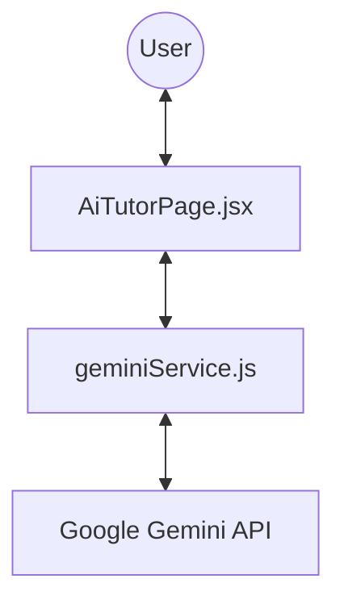

# AI Platform Architectural Overview

This document provides complete context on the AI implementation within the "Study Fly" platform.

## 1. High-Level Architecture
The AI feature is implemented as a **direct client-to-API integration**. It bypasses the Cloudflare Worker and communicates directly from the user's browser to the Google Gemini API endpoints.

## 2. Core Components

### 🎨 Frontend UI (`AiTutorPage.jsx`)
- **Route**: `/ai-tutor`
- **Location**: `src/pages/AiTutorPage.jsx`
- **Key Features**:
  - **Reasoning Mode**: A toggle that forces the AI to "think out loud." The UI parses `<think>...</think>` tags into an animated accordion.
  - **Rich Rendering**: Uses `react-markdown` and `rehype-katex` to render complex mathematical formulas and formatted study guides.
  - **Model Selection**: Allows users to switch between different Gemini models (e.g., Flash vs. Pro Preview).
  - **Quick Suggestions**: Pre-configured prompts for common Class 12 PCM tasks.

### 🧠 Service Layer (`geminiService.js`)
- **Location**: `src/services/geminiService.js`
- **Identity**: Defines the AI as **"Study Fly AI"**, an expert academic tutor for Physics, Chemistry, and Mathematics.
- **Rate-Limit Fail-Safe**: 
  - Maintains a **pool of 10 Google API keys**.
  - Implements **automatic rotation**: if one key hits a 429 error, it switches to the next one instantly.
  - **Per-Model Indexing**: Tracks key usage independently for each model (since Google rate limits are often per-key-per-model).

## 3. Configuration & Authentication
- **Models Supported**: 
  - `gemini-2.5-flash` (Stable/Fast)
  - `gemini-3-flash-preview` (Advanced/Preview)
- **API Baseline**: `https://generativelanguage.googleapis.com/v1beta/`
- **Streaming**: Uses Server-Sent Events (SSE) for real-time typewriter effects.

## 4. Navigation Context
The AI Tutor is positioned as a primary pillar of the application:
- **Global Sidebar**: Featured in `Sidebar.jsx` with a `Bot` icon and a **"NEW"** badge.
- **Entry Point**: Mapped in `App.jsx` under a `ProtectedRoute`.

> [!NOTE]
> The AI implementation is entirely decoupled from the Cloudflare Worker bots. While the Worker handles Telegram authentication and notifications, the AI Tutor is a pure browser-based companion.
